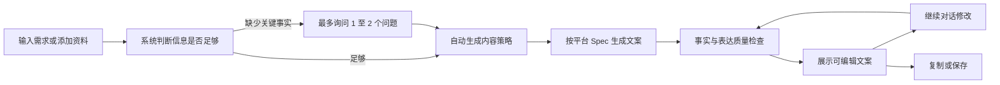
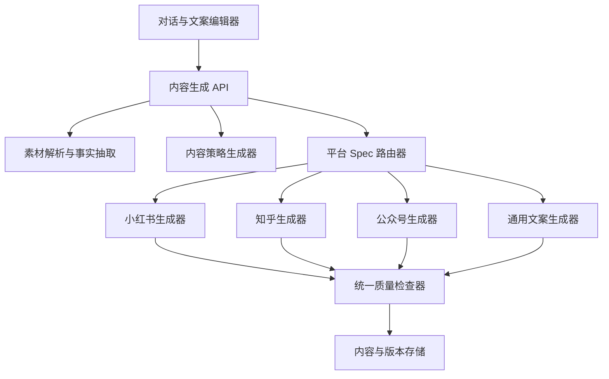

# Narraform AI 文案助手 V1 PRD 与平台生成 Spec

> 文档状态：可进入设计与开发评审  
> 版本：V1.0  
> 更新时间：2026-08-14  
> 产品范围：只生成和修改文案，不生成图片，不预览图文成品，不登录或发布到平台

## 1. Summary

Narraform AI 文案助手帮助用户把一句需求、已有文案或参考资料，转成适合小红书、知乎、微信公众号或通用场景的文案。用户主要通过对话完成创作，系统自动判断信息是否足够、推荐写作方案、生成可编辑文案，并支持继续修改、复制和保存。

V1 的重点不是“同一段话换个平台名称”，而是让每个平台使用独立的内容结构、语气、长度策略和质量标准。对外文案不得泄露 README、文件名、网页来源或系统处理过程，也不得伪造产品事实、用户经历和数据。

---

## 2. Contacts

| 角色 | 负责人 | 职责 |
|---|---|---|
| 产品负责人 | 待定 | 确认范围、平台规则和验收标准 |
| 交互与视觉 | 待定 | AI 对话、文案编辑和移动端体验 |
| 前端开发 | 待定 | 对话工作台、编辑器、记录页和状态反馈 |
| AI/后端开发 | 待定 | 素材解析、策略生成、平台路由、文案生成和质量检查 |
| 内容运营 | 待定 | 平台样例库、反例库和人工质量抽检 |

---

## 3. Background

### 3.1 当前问题

普通 AI 写作框通常存在以下问题：

1. 用户必须自己写复杂提示词，才能说明身份、受众、目标、平台和语气。
2. 同一内容切换平台时，只做缩写或扩写，没有真正重组表达。
3. 产品资料中的 README、文件路径和“根据资料得知”等内部信息容易进入对外文案。
4. 文案常出现固定 AI 句式、过度完整的结构、虚构体验和空泛价值判断。
5. 生成结果散落在对话中，不方便编辑、保存和继续修改。

### 3.2 为什么现在做

现有原型已经完成 AI 对话工作台、平台与风格选择、文案结果编辑和内容记录界面。下一步需要把平台规则从界面选项升级成可执行、可测试的内容生成协议，避免后续每个平台各写一套无法维护的提示词。

### 3.3 V1 边界

V1 包含：

- 小红书文案
- 知乎回答与知乎文章
- 微信公众号文章
- 通用文案
- 对话式补充信息
- 文案生成、改写、编辑、复制和保存
- 基础事实检查和去 AI 味检查

V1 不包含：

- 图片、封面、图文卡片和视觉分镜
- 视频脚本、口播稿和字幕
- 平台账号、自动登录、草稿箱和直接发布
- 内容排期、团队协作和数据分析
- 自动联网搜索和未经用户确认的外部事实补充
- 微博、抖音、快手、Bilibili 等平台适配

---

## 4. Objective

### 4.1 产品目标

让普通用户不需要学习提示词，只需说明“写什么”和“发到哪里”，就能获得一份符合平台表达习惯、事实可信、可以直接继续修改的文案初稿。

### 4.2 用户价值

- 降低输入成本：缺少的信息由系统推荐或用一个简短问题补齐。
- 降低改写成本：用户可以直接说“更自然”“精简”“换个开头”。
- 提高平台适配度：不同平台使用不同的信息顺序和表达方式。
- 降低内容风险：内部资料来源不进入对外文案，未经证实的信息不自动补全。
- 保留控制权：生成结果可直接编辑，并保存版本。

### 4.3 Key Results

首版上线后的一个完整评估周期内：

| 指标 | 目标 |
|---|---|
| 首次生成完成率 | 进入创作页的用户中，至少 70% 完成一次生成 |
| 首稿可用率 | 至少 55% 的首稿被复制、保存或只修改一次后保存 |
| 平均补充问题数 | 不超过 1.5 个，避免把写作变成问卷 |
| 平台规则通过率 | 自动检查中至少 90% 通过对应平台结构要求 |
| 事实违规率 | 人工抽检中，新增或夸大的事实少于 2% |
| 来源泄露率 | “README、文件名、根据资料”等内部来源泄露为 0 |
| AI 腔投诉率 | 人工抽检中明显模板化文案低于 10% |

---

## 5. Market Segments

### 5.1 核心用户

#### 内容运营

工作：把产品信息、活动信息或业务资料快速转成不同平台文案。  
困难：内容多、时间少，同时需要保持品牌口吻和平台差异。

#### 独立创作者

工作：把一个观点、经验或主题写成可以发布的内容。  
困难：知道想表达什么，但不擅长组织结构、标题和开头。

#### 产品和创业团队

工作：介绍产品、更新功能、解释方案或发布活动。  
困难：技术资料不等于用户文案，容易写成 README、功能清单或项目汇报。

### 5.2 使用约束

- 用户可能只输入一句话，也可能上传长文档。
- 用户不一定知道目标受众、内容角度和合适长度。
- 用户输入的资料可能不完整、互相冲突或包含内部信息。
- 同一个用户可能只是写观点，不一定进行产品营销。
- 用户需要结果，不希望先配置大量策略字段。

---

## 6. Value Propositions

| 用户任务 | 现有痛点 | Narraform 的做法 |
|---|---|---|
| 从零写一篇文案 | 不知道怎么向 AI 描述要求 | 用自然语言输入，系统自动补齐策略 |
| 把资料写成对外内容 | 容易复制资料措辞或泄露来源 | 先抽取事实，再隔离来源名称 |
| 适配不同平台 | 普通工具只做长短变化 | 每个平台有独立结构和质量门槛 |
| 降低 AI 味 | 固定句式、空话和假经历较多 | 生成前约束、生成后检测、对话式重写 |
| 继续修改文案 | 修改后版本容易丢失 | 结果可编辑，并保留生成与修改版本 |

产品差异点：

1. 自动推荐策略，但不把复杂策略表单暴露给用户。
2. 平台适配规则可配置、可测试，不依赖一条巨大提示词。
3. 事实内容与来源元数据分开存储。
4. “去 AI 味”不是一个按钮，而是贯穿生成和检查的规则。
5. 生成结果是可编辑文档，不是只能复制的聊天气泡。

---

## 7. Solution

## 7.1 核心用户流程



### 7.1.1 首次进入

页面只展示：

- “今天想写什么？”
- 一个主输入框
- 添加资料按钮
- 平台选择
- 风格选择
- 4 个常用示例入口

不得展示：

- 图片预览画布
- 图文分镜
- 发布包
- Skill 名称和执行过程
- 大量必填策略表单

### 7.1.2 信息补充

系统只有在缺少内容成立所必需的信息时才追问。

必须追问的情况：

- 产品或活动名称不明确，且正文无法成立。
- 用户要求写事实性成果，但没有提供成果或数据。
- 用户要求第一人称经验，但没有提供真实经历。
- 输入资料互相冲突，无法判断应采用哪个版本。

不应追问的情况：

- 受众未填写：系统可以推荐。
- 语气未填写：使用“自然、专业”。
- 长度未填写：使用平台推荐区间。
- 内容目标未填写：根据需求和平台自动判断。

每一轮最多问 2 个问题。可以用合理默认值继续生成时，不阻断用户。

### 7.1.3 生成结果

AI 回复由两部分组成：

1. 一句简短说明，可省略。
2. 一个可编辑的文案结果区。

结果区提供：

- 平台与风格标识
- 可编辑正文
- 重新写
- 更自然
- 精简
- 复制
- 保存

平台特有字段通过结果区内部结构展示，不单独打开复杂设置页。

---

## 7.2 通用生成协议

### 7.2.1 输入对象 `CopyRequest`

```json
{
  "request_id": "uuid",
  "user_instruction": "根据产品资料写一篇小红书介绍",
  "platform": "xiaohongshu",
  "content_type": "auto",
  "source_materials": [],
  "strategy": {
    "author_identity": "auto",
    "audience": "auto",
    "goal": "auto",
    "angle": "auto",
    "tone": "natural_professional",
    "length": "standard"
  },
  "constraints": {
    "must_include": [],
    "must_avoid": [],
    "allow_emojis": "auto",
    "allow_external_facts": false
  }
}
```

### 7.2.2 素材事实对象 `FactSet`

```json
{
  "verified_facts": [
    {
      "fact_id": "fact_001",
      "statement": "产品支持多租户和 RBAC",
      "source_id": "source_01",
      "confidence": "high"
    }
  ],
  "claims_requiring_confirmation": [],
  "conflicts": [],
  "source_metadata": [
    {
      "source_id": "source_01",
      "display_name": "内部产品资料",
      "original_filename": "README.md",
      "externalizable": false
    }
  ]
}
```

生成模型只能使用 `verified_facts.statement`，不得把 `original_filename`、文件路径或处理方式写入对外文案。

### 7.2.3 策略对象 `ContentStrategy`

系统在后台自动生成：

```json
{
  "author_identity": "产品团队",
  "audience": "需要把 AI 接入复杂业务研发的技术负责人",
  "goal": "建立产品理解和可信度",
  "angle": "AI 参与业务开发前，需要先明确工程边界",
  "content_type": "product_explanation",
  "tone": "natural_professional",
  "reason": "资料以工程能力和适用边界为主，适合解释型内容"
}
```

策略默认不要求用户确认。用户修改生成方向时，系统更新策略并保留上一版本。

### 7.2.4 输出对象 `CopyResult`

```json
{
  "result_id": "uuid",
  "platform": "xiaohongshu",
  "content_type": "product_explanation",
  "title_candidates": [],
  "body_markdown": "",
  "summary": null,
  "topics": [],
  "quality_report": {
    "fact_check": "pass",
    "source_leak_check": "pass",
    "platform_check": "pass",
    "ai_style_check": "pass",
    "warnings": []
  },
  "strategy_snapshot": {}
}
```

---

## 7.3 平台 Spec 总览

> 下表中的长度是 Narraform 的推荐生成区间，不等同于平台永久不变的官方上限。平台硬限制必须由服务端配置维护，并显示规则更新时间。

| 平台 | V1 内容类型 | 推荐正文长度 | 主要目标 | 默认表达方式 |
|---|---|---:|---|---|
| 小红书 | 产品介绍、经验分享、教程、清单、活动推广、观点 | 300-800 中文字符 | 快速理解、收藏、互动 | 场景切入，短段落，具体直接 |
| 知乎回答 | 问题回答、经验解释、方案分析 | 800-2500 中文字符 | 回答问题、建立可信度 | 先给结论，再解释和论证 |
| 知乎文章 | 教程、分析、观点长文 | 1200-3500 中文字符 | 完整表达和长期沉淀 | 标题明确，结构完整，信息密度高 |
| 微信公众号 | 产品文章、教程、观点、活动、复盘 | 1200-2500 中文字符 | 深度阅读、品牌沟通 | 开头建立阅读理由，分节推进 |
| 通用文案 | 介绍、通知、推广、改写、摘要 | 100-800 中文字符 | 快速获得可复用文本 | 服从用户场景，不套平台习惯 |

### 7.3.1 公共规则

所有平台必须：

- 保留用户明确指定的事实、名称、时间和数字。
- 不补造价格、客户、用户数量、融资、性能和市场排名。
- 不伪造“我使用后”“我们团队实测”等第一人称经历。
- 不出现“根据 README”“根据你提供的资料”“文档显示”“本文将”等来源或生成过程描述。
- 不自动使用“领先、第一、颠覆、完美、全网最好”等无法证明的绝对表述。
- 不为了显得自然而添加虚构人物、场景、对话或案例。
- 不把功能名称简单排列成一串；需要解释功能与用户问题的关系。
- 用户没有要求营销时，不强制添加购买、关注、私信或转化话术。

### 7.3.2 平台规则版本化

平台规则使用独立配置，不写死在提示词中：

```json
{
  "platform": "xiaohongshu",
  "spec_version": "2026.08-v1",
  "effective_at": "2026-08-14",
  "recommended_lengths": {},
  "hard_limits": {},
  "content_types": [],
  "validators": [],
  "prompt_policy_id": "xhs-copy-v1"
}
```

当平台限制变化时，只更新配置和验证器，不要求重新发布前端。

---

## 7.4 小红书文案 Spec

### 7.4.1 适用内容类型

| 类型 | 使用场景 | 默认结构 |
|---|---|---|
| 产品介绍 | 介绍产品价值和适用人群 | 场景问题 → 产品做法 → 关键能力 → 适用边界 |
| 经验分享 | 分享真实经历或方法 | 情境 → 发现 → 做法 → 结果或反思 |
| 教程 | 教用户完成一个任务 | 结果预告 → 步骤 → 注意事项 → 总结 |
| 清单 | 工具、方法或建议集合 | 使用背景 → 分点内容 → 选择建议 |
| 活动推广 | 活动报名或信息通知 | 活动价值 → 核心信息 → 适合谁 → 行动方式 |
| 观点 | 表达一个可讨论判断 | 明确观点 → 原因 → 例子或边界 → 开放结尾 |

### 7.4.2 输出字段

- 标题候选：3 个
- 正文：1 份
- 话题建议：3-8 个
- 可选首句候选：2 个，仅在用户要求时生成

### 7.4.3 标题规则

- 推荐 12-20 个中文字符，具体硬限制读取平台配置。
- 标题需要表达内容收益、问题或具体判断。
- 不强制使用感叹号、数字和情绪词。
- 同一批候选标题必须采用不同角度，不能只替换同义词。
- 产品介绍标题优先表达用户问题，不默认把产品名放在第一位。

合格示例：

- `让 AI 写业务代码前，先解决这 3 个边界问题`
- `复杂业务系统，为什么不能只靠 AI 临场生成？`

不合格示例：

- `震惊！这个工具真的太绝了！`
- `Open Mercato README 深度解读`
- `AI 时代下的全新变革与无限可能`

### 7.4.4 正文规则

- 推荐 300-800 中文字符。
- 每段通常 1-3 句，允许长短变化，不强制每段同样长度。
- 前 80 个字符内说明问题、场景或明确观点。
- 产品内容需要同时说明“能做什么”和“适合谁”，必要时说明“不适合什么”。
- 列表只在内容确实包含步骤或并列项时使用。
- Emoji 默认 0-4 个；专业、严肃和知识型内容默认不用。
- 话题标签放在正文末尾，不穿插在句子中。
- 不默认使用“姐妹们、宝子们、家人们、绝绝子、闭眼冲、狠狠爱了”。
- 不用连续问句制造焦虑。

### 7.4.5 小红书验收标准

- [ ] 前两段能独立说明内容为什么值得看。
- [ ] 正文不是产品功能清单。
- [ ] 没有虚构个人体验和用户评价。
- [ ] 段落适合手机阅读。
- [ ] 标题与正文主张一致。
- [ ] 话题与正文主题直接相关。
- [ ] 删除品牌名后，正文仍然能说明用户问题和价值。

---

## 7.5 知乎文案 Spec

## 7.5.1 知乎回答

### 适用内容类型

- 原理解释
- 经验回答
- 方案比较
- 产品相关问题回答
- 行业观点

### 输出字段

- 回答标题：沿用问题标题；用户未提供问题时给出 3 个问题候选
- 回答正文：1 份 Markdown
- 一句话结论：1 条，用于编辑器摘要，不默认插入正文

### 推荐结构

1. 直接回答问题，不先写大段背景。
2. 解释判断依据。
3. 使用事实、例子、步骤或对比支撑。
4. 说明适用条件、限制或反例。
5. 用简短结论收束，不强行升华。

### 写作规则

- 推荐 800-2500 中文字符。
- 开头 150 个字符内给出核心判断。
- 标题和问题已经包含的信息，不在开头机械重复。
- 允许使用二级标题，但每篇通常不超过 5 个。
- 有明确推理关系时才使用“首先、其次、最后”。
- 产品内容必须先解决问题，再自然说明产品做法。
- 未提供真实身份时，不写“作为一个从业十年的工程师”。
- 未提供真实测试时，不写“亲测”“实测”“用了三个月”。
- 不把回答写成品牌新闻稿或软文导语。

### 知乎回答验收标准

- [ ] 第一屏已经回答问题。
- [ ] 每个主要结论有事实或逻辑支撑。
- [ ] 产品名出现前，读者已经理解讨论的问题。
- [ ] 没有伪造专业身份和使用经历。
- [ ] 至少说明一个适用边界或限制。
- [ ] 删除结尾段后，正文仍完整，不依赖空泛总结。

## 7.5.2 知乎文章

### 输出字段

- 标题候选：3 个
- 摘要：60-120 个中文字符
- 正文：1 份 Markdown

### 写作规则

- 推荐 1200-3500 中文字符。
- 标题表达明确主题或判断，不使用模糊宏大词。
- 开头交代读者问题、文章结论或阅读收益。
- 正文通常使用 3-6 个章节。
- 章节之间需要推进关系，不是几个相互独立的观点堆叠。
- 结论可以总结选择条件、行动建议或未解决问题。
- 不为凑长度重复解释同一观点。

---

## 7.6 微信公众号文案 Spec

### 7.6.1 适用内容类型

| 类型 | 默认结构 |
|---|---|
| 产品介绍 | 用户问题 → 产品判断 → 解决方式 → 能力与边界 → 结语 |
| 教程 | 目标 → 前置条件 → 步骤 → 常见问题 → 总结 |
| 观点文章 | 现象 → 核心判断 → 分析 → 影响 → 结论 |
| 活动文章 | 为什么参加 → 活动信息 → 内容亮点 → 适合人群 → 报名方式 |
| 更新说明 | 变化背景 → 新能力 → 使用方式 → 影响范围 → 后续计划 |
| 复盘 | 目标 → 过程 → 结果 → 问题 → 下一步 |

### 7.6.2 输出字段

- 标题候选：3 个
- 摘要：60-100 个中文字符
- 正文：1 份 Markdown
- 结尾行动建议：可选；只有内容目标需要时生成

### 7.6.3 标题规则

- 推荐 18-28 个中文字符，硬限制读取平台配置。
- 标题需要准确，不使用正文无法兑现的悬念。
- 产品文章可以使用“产品名 + 变化/能力”，但不是默认格式。
- 3 个标题分别侧重：问题、观点、收益或变化，不能只是改标点。

### 7.6.4 正文规则

- 推荐 1200-2500 中文字符。
- 开头 200 个字符内建立阅读理由。
- 通常使用 3-6 个二级标题。
- 每节围绕一个问题展开，段落通常不超过 5 句。
- 重要信息优先用短句、列表或加粗，不堆叠口号。
- 产品介绍必须解释能力如何作用于真实任务。
- 结尾不默认写“未来已来”“让我们拭目以待”“共创美好未来”。
- 不默认要求关注、点赞、转发；只有用户指定运营目标时添加。

### 7.6.5 微信公众号验收标准

- [ ] 标题与摘要表达不同信息，不机械重复。
- [ ] 开头说明了读者问题或文章判断。
- [ ] 每个章节都有明确作用。
- [ ] 文章可以在微信编辑器中直接继续排版。
- [ ] 没有技术资料口吻和内部文件引用。
- [ ] 没有为了显得正式而堆砌抽象名词。

---

## 7.7 通用文案 Spec

### 7.7.1 使用场景

- 产品简介
- 活动通知
- 官网或应用内说明
- 社群文案
- 销售辅助文本
- 已有文案润色
- 摘要和缩写

### 7.7.2 输出字段

- 主文案：1 份
- 备选版本：默认不生成；用户明确要求“多给几个版本”时生成 2-3 份
- 标题：仅在场景需要时生成

### 7.7.3 写作规则

- 推荐 100-800 中文字符，服从用户明确长度要求。
- 不自动套用小红书标签、知乎回答结构或公众号章节。
- 优先保留用户原文中的术语、事实和表达习惯。
- 润色任务默认小改，不改变观点和事实。
- 用户说“改自然”时，先减少模板句和抽象词，不自动改成网络口语。
- 用户说“专业”时，提高准确度和信息密度，不增加官话。

---

## 7.8 去 AI 味 Spec

### 7.8.1 目标

“去 AI 味”不是故意制造错别字或不完整表达，而是减少模型常见的模板结构，让文案更接近真实作者在具体场景中的表达。

### 7.8.2 默认避免的句式

- “在当今快速发展的时代……”
- “随着……的不断发展……”
- “值得一提的是……”
- “不仅……更……”连续出现
- “从某种意义上来说……”
- “总而言之，让我们……”
- “这不仅是一款产品，更是一场革命。”
- “无论你是 A、B，还是 C，都能……”
- 每一段都使用“首先、其次、此外、最后”
- 每个章节结尾都进行一次升华

这些句式不是绝对禁用，但同一篇内容不得反复出现，且必须有真实语义作用。

### 7.8.3 生成要求

- 先确定一个明确判断，再组织信息，不先生成万能开头。
- 使用资料里的具体名词、动作和限制，减少“赋能、助力、打造、生态、闭环”等抽象词。
- 句子长短可以变化，不让每段拥有相同节奏。
- 允许保留作者的谨慎、限定和不确定性。
- 不追求每篇都有完美的三段式或五点清单。
- 观点内容允许有取舍，但不得制造无依据的极端立场。
- 营销内容也要说明具体价值，不使用空洞兴奋语气代替事实。

### 7.8.4 自动检查维度

| 维度 | 检查内容 | 不通过条件 |
|---|---|---|
| 模板句密度 | 常见 AI 套话占比 | 连续出现或成为段落主干 |
| 抽象词密度 | 赋能、生态、闭环等 | 抽象词没有具体动作解释 |
| 结构机械度 | 段落和句式是否过度整齐 | 多段使用完全相同结构 |
| 虚构人设 | 经验、身份、测试是否有来源 | 素材未提供却使用第一人称证明 |
| 空泛总结 | 结尾是否只做价值升华 | 删除结尾不影响任何信息且全是口号 |
| 来源泄露 | 是否出现内部资料信息 | 出现文件名、路径、README 或处理过程 |

### 7.8.5 “更自然”操作

点击“更自然”后，系统必须：

1. 保持事实、目标平台和核心观点不变。
2. 优先改写开头、过渡句、模板句和空泛结尾。
3. 保留用户指定的专业术语。
4. 不添加网络热词、Emoji 或第一人称经历，除非用户要求。
5. 返回修改后的完整文案，并记录与上一版本的差异。

---

## 7.9 对话修改 Spec

系统需要识别以下常用修改意图：

| 用户指令 | 系统行为 |
|---|---|
| 更自然一点 | 执行去 AI 味改写，事实不变 |
| 精简 | 默认缩短 25%-40%，保留核心事实和观点 |
| 展开一点 | 增加解释或细节，只能使用已有事实 |
| 换个开头 | 只修改开头，正文主体尽量不变 |
| 不要营销感 | 删除夸张形容、强 CTA 和自我赞美 |
| 更像产品官方 | 使用第一方身份，但不写成公告或 README |
| 更像个人分享 | 只有用户提供真实经历时才使用第一人称经验 |
| 改成知乎/公众号/小红书 | 保留事实，重新按目标平台 Spec 组织全文 |
| 给我三个版本 | 生成 3 个角度明显不同的完整版本 |
| 保留这段，其余重写 | 锁定指定文本，仅重写其他部分 |

修改任务必须基于当前选中的文案版本，不重新读取整段聊天后随意改变事实。

---

## 7.10 功能需求

### FR-01 新建文案

- 用户可以从左侧菜单或顶部按钮新建对话。
- 新建后展示空白欢迎态和输入框。
- 有未保存修改时，需要提示用户保存或放弃。

验收：新建操作不保留上一条对话的正文、平台和附件，但可以保留用户最近使用的平台偏好。

### FR-02 输入需求

- 支持多行文字输入。
- Enter 发送，Shift+Enter 换行。
- 空输入不能发送。
- 生成期间避免重复提交。

### FR-03 添加资料

V1 支持：

- 粘贴文本
- TXT
- Markdown
- PDF
- DOCX
- 网页链接，由用户主动提供

单次最多 10 个来源。单个文件和总容量限制由服务端配置。

资料状态：上传中、解析中、可使用、解析失败、需要确认。

### FR-04 平台选择

- 默认使用上一次平台；首次使用默认“小红书”。
- 选项：小红书、知乎、公众号、通用文案。
- 知乎在系统需要时自动判断回答或文章，也允许用户指定。
- 切换平台不会立即删除当前文案，只有发送修改要求后才生成新版本。

### FR-05 风格选择

V1 预设：

- 自然、专业
- 轻松口语
- 简洁直接
- 有观点

风格只调整表达，不得覆盖平台规则、事实约束和用户明确要求。

### FR-06 生成前策略

- 自动生成身份、受众、目标、角度、内容类型和长度档位。
- 默认不显示完整策略配置。
- 用户可以通过自然语言修改策略。
- 后续可在“生成设置”抽屉中查看和编辑，V1 可不实现。

### FR-07 文案生成

- 生成结果必须符合目标平台 Spec。
- 生成前使用事实集合，不直接向模型传递来源文件名。
- 生成失败时保留用户输入和附件。
- 支持停止生成，V1.1 实现。

### FR-08 文案编辑

- 结果正文可以直接编辑。
- 编辑内容自动保存到本地草稿状态。
- 用户发送新修改要求时，以编辑后的最新正文为基准。
- 文案编辑器需要显示字符数；平台硬限制存在时显示剩余额度。

### FR-09 快捷修改

- 重新写：保留事实和策略，生成不同表达。
- 更自然：执行 7.8.5。
- 精简：执行对话修改 Spec。
- 快捷修改不得覆盖用户尚未保存的手工编辑，需要先确认或自动建立版本。

### FR-10 复制

- 复制正文时不包含平台标签、质量报告和系统说明。
- 小红书可以选择“复制正文”或“复制正文和话题”，V1 默认复制全部可发布文本。
- 复制成功显示明确反馈。

### FR-11 保存和版本

- 保存内容包括标题、正文、平台、策略快照、事实引用 ID 和生成时间。
- 每次重新生成、跨平台改写或大幅修改创建新版本。
- 手工输入按时间自动保存，避免每次按键都创建版本。
- 内容记录页默认显示最新版本。

### FR-12 内容记录

- 显示名称、平台/类型、更新时间和状态。
- 支持打开、重命名和删除。
- V1 不提供文件夹、团队空间和高级搜索。

### FR-13 质量检查

生成结果展示前执行：

- 事实检查
- 来源泄露检查
- 平台结构检查
- 去 AI 味检查
- 敏感和高风险表达检查

可自动修复的问题先自动修复。涉及事实冲突或高风险声明时，提示用户确认，不静默改写。

---

## 7.11 状态与异常

| 状态 | 用户界面 |
|---|---|
| 空白 | 欢迎语、快捷入口、输入框 |
| 正在上传 | 附件显示进度，仍可编辑输入 |
| 正在解析 | 显示“正在读取资料” |
| 需要补充 | AI 用一个简短问题询问 |
| 正在生成 | 显示生成状态，禁用重复发送 |
| 生成完成 | 展示可编辑文案和操作按钮 |
| 部分事实不确定 | 在文案上方显示非阻断警告 |
| 生成失败 | 保留输入，提供重试 |
| 网络中断 | 本地保留编辑内容，恢复后重试 |
| 保存成功 | 显示“已保存到内容记录” |

错误提示必须说明用户下一步能做什么。例如：“PDF 没有可读取文字，请换一个文件或粘贴正文。”不得只显示“解析失败”。

---

## 7.12 数据与技术方案

### 7.12.1 建议模块



### 7.12.2 平台生成器责任

每个平台生成器只负责：

- 选择该平台内容结构
- 生成平台特有字段
- 应用长度和表达规则
- 返回统一 `CopyResult`

事实抽取、来源隔离、敏感检查和版本存储不得在各平台重复实现。

### 7.12.3 提示词分层

建议使用四层规则：

1. 全局事实和安全规则
2. 平台 Spec
3. 当前内容策略
4. 用户本轮要求和当前文案

优先级：事实与安全 > 用户明确要求 > 平台规则 > 风格预设 > 系统推荐。

### 7.12.4 可观测性

每次生成记录：

- 请求 ID
- 模型与提示词策略版本
- 平台 Spec 版本
- 使用的事实 ID
- 生成耗时
- 自动检查结果
- 用户后续操作：编辑、重写、复制、保存

日志不得记录完整敏感资料；原文存储需遵循后续隐私策略。

---

## 7.13 非功能需求

### 性能

- 首次文字反馈在 2 秒内出现。
- 普通文案目标在 15 秒内生成完成。
- 长文目标在 35 秒内生成完成。
- 生成超过目标时间时显示明确进度，不让界面无反馈。

### 可用性

- 桌面和移动端均可完成输入、生成、编辑、复制和保存。
- 页面不得出现横向滚动。
- 键盘可以完成主要操作。
- 生成状态和错误状态需要被辅助技术识别。

### 可靠性

- 用户手工编辑内容每 2 秒防抖自动保存到本地。
- 页面刷新后可以恢复最近未保存草稿。
- 同一请求重试不得重复创建多条内容记录。

### 隐私

- 用户资料默认只用于本次生成，不进入公共样例库。
- 来源文件名不传入最终写作上下文。
- 删除内容时同步删除相关附件和版本，保留必要审计信息需单独声明。

---

## 7.14 假设与待验证问题

### 已采用假设

- 用户更愿意通过对话修正文案，而不是填写完整策略表单。
- 四个平台选项能覆盖 V1 的主要需求。
- “自然、专业”适合作为默认风格。
- 推荐长度比强制固定长度更适合内容质量。
- 大多数请求可以在不追问或只追问一次后生成。

### 待验证

- 用户是否需要在生成前查看系统推荐的受众和角度。
- 小红书用户是否希望默认生成话题标签。
- 知乎回答和文章是否应作为两个显式入口。
- 用户是否理解“通用文案”和平台文案的区别。
- “更自然”是否足以覆盖大部分 AI 味修改需求。
- 自动保存版本的粒度是否会造成版本过多。

---

## 8. Release

## 8.1 V1 必须完成

- AI 对话创作页
- 文本输入和资料添加
- 小红书、知乎、公众号、通用文案平台路由
- 自动内容策略
- 四套平台生成 Spec
- 可编辑文案结果
- 重新写、更自然、精简
- 复制和保存
- 内容记录
- 事实、来源泄露、平台和 AI 腔检查
- 桌面与移动端适配
- 平台规则版本配置

建议开发周期：3-5 个迭代，具体取决于素材解析和模型接入基础。

## 8.2 V1.1

- 停止生成
- 标题候选切换
- 选中局部文本后对话修改
- 文案差异对比
- 更完整的版本历史
- 用户自定义品牌语气
- 知乎回答/文章显式切换

## 8.3 V2

- 微博、抖音、快手和 Bilibili 文案 Spec
- 视频口播稿与脚本
- 图片和图文卡片生成
- 发布前合规检查增强
- 平台草稿箱和人工确认发布
- 内容排期与发布状态

## 8.4 上线门槛

上线前必须完成以下测试集：

1. 每个平台至少 30 个生成用例。
2. 产品介绍、观点、教程、活动和改写各至少 10 个跨平台用例。
3. 至少 20 个来源泄露攻击用例，包括 README、文件名和路径。
4. 至少 30 个 AI 腔反例用例。
5. 至少 20 个事实不足或资料冲突用例。
6. 桌面端和移动端完整生成流程自动测试。

人工评审每份文案按以下 5 项打分，每项 1-5 分：

- 事实准确
- 平台适配
- 表达自然
- 信息价值
- 可直接修改使用

平均分不低于 4.0，且事实准确不得低于 4 分，才允许进入公开测试。

---

## 附录 A：平台生成验收用例

### 用例 A1：产品资料转小红书

输入：产品介绍、功能列表和技术文档。  
预期：先写用户遇到的工程问题，再解释产品做法；不出现 README；不伪造“亲测”；输出标题、正文和话题。

### 用例 A2：产品资料转知乎回答

输入：问题“AI 参与复杂业务开发，真正困难的是什么？”和产品资料。  
预期：开头直接回答；正文给出工程边界、权限和人工确认的解释；产品作为解决思路出现，不写成广告。

### 用例 A3：同一资料转公众号文章

输入：与 A1 相同。  
预期：形成完整文章；有标题、摘要和章节；说明适用团队和限制；不复制技术文档结构。

### 用例 A4：普通观点内容

输入：“我觉得不是所有内容都需要追热点，帮我写一篇知乎回答。”  
预期：不要求产品资料；自动推荐观点型结构；不添加虚构数据和个人履历。

### 用例 A5：只有一句模糊需求

输入：“帮我宣传一下。”  
预期：询问宣传对象和已知信息，不直接编造产品。

### 用例 A6：去 AI 味

输入：一篇包含“在当今时代、赋能、生态闭环、未来已来”的文章，要求“改自然”。  
预期：保留事实和观点，删除空泛开头与升华，增加具体表达，不添加网络热词。

---

## 附录 B：V1 Definition of Done

- [ ] 用户只用一句清晰需求即可完成生成。
- [ ] 系统不会把策略配置变成创作前必填问卷。
- [ ] 四个平台使用独立 Spec，不共享同一正文模板。
- [ ] 文案结果可编辑，并作为后续修改的最新基准。
- [ ] 内部来源信息不会进入对外文案。
- [ ] 未经确认的事实不会被写成确定陈述。
- [ ] “更自然”不会自动添加假经历、网络热词或 Emoji。
- [ ] 内容记录可以恢复最新版本。
- [ ] 移动端可以完成完整流程，无横向溢出。
- [ ] 自动测试和人工平台样例评审达到上线门槛。
