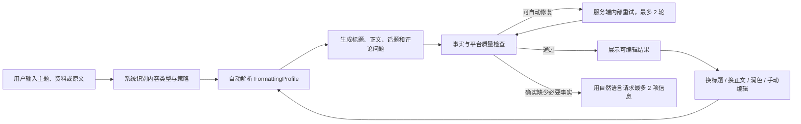

# PRD：小红书自适应文案与排版 v1

状态：Engineering implementation completed and verified  
关联规范：`NARRAFORM-XHS-PLATFORM-SPEC-v4.md`  
产品范围：Narraform 文案生成后台  
版本：2026.08-v1

## 1. Summary

本项目把小红书文案的 Hook、段落、Emoji、清单、CTA 和话题从静态 Prompt 提示升级为可计算、可继承、可检查的 `FormattingProfile`。用户仍然只需描述想写的内容；系统自动选择合适的平台表达，首次生成、换标题、换正文、润色和自定义修改使用同一套规则。

V1 只处理文字内容和 Unicode Emoji，不生成图片贴纸、表情包素材、封面或轮播图。

## 2. Contacts

| 角色 | 负责人 | 职责 |
|---|---|---|
| 产品负责人 | 用户 / 待指定 | 确认范围、验收表达质量 |
| 内容规范负责人 | Narraform | 维护 XHS Platform Spec 和黄金样例 |
| 后端负责人 | 待指定 | 规则解析、内容合同、质量与重试 |
| 前端负责人 | 待指定 | 平台感控制、状态展示和自动保存 |
| 测试负责人 | 待指定 | 自动化用例、人工盲评和回归 |

## 3. Background

### 3.1 当前问题

现有 `platform-specs.js` 已经规定小红书标题、短段、Emoji 数量和话题范围，但这些规则主要以文本数组传给模型，存在以下问题：

- “自然口语”“Emoji 0-4 个”仍然是模糊指令，模型每次理解可能不同。
- 产品营销、教程、观点等内容共享同一套排版倾向。
- 资料不足时容易把推荐长度误当成生成门槛。
- 换标题、换正文、润色没有持久化同一个排版决策。
- 换正文目前只允许写 `bodyMarkdown`，话题和评论问题可能与新正文失去一致性。
- 质量检查更关注事实和字段结构，对 Emoji 语义、段落节奏、标题角度、CTA 和标签分层检查不足。
- 技术错误和内部重试不应暴露给普通用户。

### 3.2 为什么现在做

Narraform 已具备 `TaskBrief + StrategySpec + PlatformSpec + OperationSpec` 骨架，也已经支持五类内容操作和自动重试。现在增加结构化格式规则，不需要推翻内容引擎，能够直接补齐平台原生感和跨操作一致性。

竞品普遍提供风格、多候选、Emoji、话题和模板；更完整的产品还把标题、正文、封面、轮播和风险检查串成工作台。Narraform V1 的差异化不是堆更多模板，而是让平台感自动适应内容，并继续服从事实安全。

## 4. Objective

### 4.1 目标

让用户只提供主题、产品信息或原始内容，就能得到符合小红书手机阅读习惯、标题正文一致、不过度模板化且可继续修改的文案。

### 4.2 非目标

- 不生成封面、轮播图、图片贴纸或视觉表情包。
- 不接入小红书账号、发布、排期和数据分析。
- 不承诺“爆款”或用点击率预测证明质量。
- 不用故意错别字、虚构经历和随机口癖模拟真人。
- 不在 V1 建立用户级品牌 Voice 学习系统。

### 4.3 Key Results

- KR1：黄金用例中，无依据产品事实、数字、体验和效果新增率为 0。
- KR2：首次生成、换标题、换正文、润色的 FormattingProfile 继承正确率为 100%。
- KR3：换标题后正文及话题字段保持率为 100%；换正文后选中标题保持率为 100%。
- KR4：标题正文语义一致性自动检查通过率达到 95% 以上，剩余结果不得覆盖当前版本。
- KR5：Emoji 数量、连续堆叠、段落长度和话题数量规则通过率为 100%。
- KR6：不少于 30 个混合主题样例的人工盲评中，“适合直接编辑后发布”比例相对当前基线提升 30%。
- KR7：普通用户看不到模型错误、字段校验详情和内部重试过程。

## 5. Market Segments

### 5.1 核心用户

需要快速写小红书内容，但不希望学习 Prompt 或逐项设置文案参数的人。他们的任务可能是产品介绍、教程、观点、经验分享、活动通知或版本更新，不等同于统一的“种草营销”。

### 5.2 主要任务

- 给出少量产品信息，先得到一篇可信的宣传文案。
- 把已有内容改成更适合小红书阅读的形式。
- 快速更换标题，但保持当前正文含义。
- 根据选中标题更换正文，并同步得到匹配的话题。
- 对现有正文做局部润色，不破坏事实和个人修改。

### 5.3 约束

- 用户输入可能只有一两句话，没有截图、数据或案例。
- 用户可能不懂平台文案术语。
- 内容可能是技术、专业或严肃主题，不适合高密度 Emoji。
- 用户会直接编辑生成结果，系统必须保存并尊重最新版本。

## 6. Value Propositions

| 用户痛点 | V1 价值 |
|---|---|
| 不知道怎样排成小红书正文 | 系统自动处理 Hook、短段、清单和互动 |
| Emoji 经常太多或乱放 | 根据内容类型选择密度，并按语义检查 |
| 每篇都像同一个营销模板 | 内容结构由任务类型和策略决定 |
| 信息少就被反复要求补资料 | 有主体和一项可用信息即可先生成短版 |
| 换标题后与正文不一致 | 换标题强制以当前正文为语义边界 |
| 换正文后标签仍是旧内容 | 新正文同时重算话题和评论问题 |
| 自动润色改掉事实或用户原话 | 字段权限、事实集合和当前版本共同约束修改 |

## 7. Solution

### 7.1 用户流程



用户完成首次生成的必需操作只有：

1. 输入要写的主题、产品介绍或现有文字。
2. 选择小红书；如果已在小红书页面则不需要再选。
3. 点击生成。

平台感默认自动选择。高级控制不是必填项。

### 7.2 功能一：FormattingProfile Resolver

新增 `xhs-formatting.js`，负责：

- 根据 `contentType`、`authorRole`、`goal`、风险类型和资料充足度选择平台感。
- 解析 Hook、段落、Emoji、清单、CTA 和话题策略。
- 合并用户覆盖项，但不允许覆盖事实和安全边界。
- 输出稳定、可序列化的 FormattingProfile。
- 验证 Profile 字段完整性和数值范围。

解析必须是确定性规则。相同输入和相同用户偏好应得到相同 Profile；正文表达可以变化。

### 7.3 功能二：XHS Platform Spec v4

扩展 `server/platform-specs.js`：

- 版本升级为 `2026.08-v4`。
- 增加 `contentPatterns`。
- 增加 `formatting.platformFeelProfiles`。
- 增加段落、Emoji、Hook、清单、CTA 和话题策略。
- 增加按操作划分的一致性规则。
- 保持现有对外输出字段不变。

Prompt 不再接收“适量 Emoji”一类模糊描述，而是接收已解析的范围、允许角色和排版目标。

### 7.4 功能三：自适应长度

修改任务理解和生成合同：

- 只有缺少主体和任何可使用描述时才阻止首次生成。
- 1-2 个事实生成 180-350 字短版。
- 3-6 个事实生成 300-600 字标准版。
- 7 个以上事实生成 500-800 字丰富版。
- 用户给出真实数据就使用；没有数据则采用非量化价值表达。
- 长度不足产生建议或自动缩短目标，不要求补造信息。

### 7.5 功能四：统一内容操作

调整 `server/operation-specs.js`：

| 操作 | V1 字段权限 |
|---|---|
| 首次生成 | 标题、正文、话题、评论问题、FormattingProfile |
| 换标题 | 标题候选和选中索引 |
| 换正文 | 正文、话题、评论问题 |
| 润色 | 用户选择范围内的正文 |
| 自定义修改 | 用户明确指定的字段 |

所有后续操作从当前结果读取：

- 当前选中标题。
- 当前正文，包括用户手动修改。
- 当前话题和已删除话题。
- 当前 FormattingProfile。
- 当前正文哈希和父版本 ID。

`regenerate_body` 写权限从仅 `bodyMarkdown` 扩展到 `bodyMarkdown + topics + commentPrompt`。这是必要的依赖更新，不允许修改标题。

### 7.6 功能五：小红书质量检查器

在 `server/quality.js` 增加独立检查：

- `xhs_title_weighted_length`
- `xhs_title_body_alignment`
- `xhs_title_angle_diversity`
- `xhs_hook_strength`
- `xhs_paragraph_scanability`
- `xhs_paragraph_rhythm`
- `xhs_emoji_count`
- `xhs_emoji_sequence`
- `xhs_emoji_semantic_role`
- `xhs_cta_alignment`
- `xhs_topic_count`
- `xhs_topic_relevance`
- `xhs_topic_duplicate_intent`
- `xhs_internal_process_leak`

检查顺序：

```text
字段结构
→ 事实与经历
→ 操作字段权限
→ 标题正文一致性
→ 平台硬限制
→ 排版、Emoji、CTA 和话题
→ AI 模板感建议
```

可修复问题由服务端内部重试，最多 2 轮。重试仍失败时保留旧结果，并返回面向用户的简短状态，不展示规则 ID、模型错误或 Prompt。

### 7.7 功能六：前端最小控制

生成输入区增加一个非必填的“平台感”控制：

- 自动
- 克制清楚
- 自然分享
- 更活跃

默认折叠在表达设置中，不增加首次使用负担。每个选项展示一句效果示例，而不是只显示抽象风格名。

结果区只显示用户需要的信息：

- 当前平台感，例如“自然分享”。
- 生成、换一批和润色的正常进度。
- 必要时显示“已自动调整排版”一类自然提示。

不得显示：

- FormattingProfile JSON。
- 规则 ID、重试次数和质量分数。
- 模型服务原始错误。
- “请重新点击确认以修复”一类内部流程提示。

### 7.8 自动保存

- 用户手动编辑标题、正文或话题后自动保存。
- 保存采用防抖，建议 500-800ms。
- 后续操作必须读取最近一次成功保存的内容。
- 删除话题写入当前结果版本的 `removedTopics`，避免自动保存或局部操作后恢复。
- 发生正文哈希冲突时，不覆盖用户新编辑；将生成结果保留为候选版本。

### 7.9 数据模型

结果记录新增：

```json
{
  "platformSpecVersion": "2026.08-v4",
  "formattingProfile": {},
  "formattingOverride": {
    "platformFeel": "auto",
    "emoji": "auto"
  },
  "removedTopics": [],
  "bodyHash": "sha256",
  "parentResultId": "result_uuid",
  "operation": "generate"
}
```

历史结果没有 Profile 时，在第一次后续操作前自动推断并保存，不修改其正文。

### 7.10 API 变化

首次生成和内容操作请求增加可选字段：

```json
{
  "formattingOverride": {
    "platformFeel": "auto",
    "emoji": "auto"
  }
}
```

响应增加：

```json
{
  "formatting": {
    "platformFeel": "natural",
    "label": "自然分享"
  }
}
```

公开响应不返回详细 Profile 和内部质量诊断。

### 7.11 错误处理

| 情况 | 系统行为 | 用户看到 |
|---|---|---|
| Emoji 或段落不合规 | 自动修复 | 正常生成状态 |
| 标题与正文不一致 | 自动重试，最多 2 次 | 正常生成状态 |
| 模型返回无效 JSON | 重试或保留旧版本 | “这次没有生成成功，原内容已保留” |
| 用户编辑期间结果返回 | 不覆盖，保存为候选 | “已有新编辑，生成结果已保留为候选” |
| 缺少主体和可使用描述 | 请求最少信息 | “告诉我它是什么或能做什么即可” |
| 没有截图、数字或案例 | 正常生成 | 不提示缺失 |

### 7.12 Assumptions

- 用户更希望系统自动判断平台表达，而不是填写详细参数。
- `克制 / 自然 / 活跃` 足以覆盖 V1 的主要平台感差异。
- 结构化规则与人工黄金样例组合，比单一 AI 味分数更可靠。
- 标题正文一致性可以通过规则、语义模型和失败保护共同达到可用水平。
- 图片贴纸和轮播视觉需要独立 Visual Spec，不能混入文字排版实现。

### 7.13 测试与验收

#### 单元测试

- 每种内容类型解析正确的平台感、Emoji 范围和结构。
- 用户覆盖项正确合并。
- 高风险主题自动降低平台感。
- sparse/normal/rich 长度档正确。
- Emoji 计数、连续串和重复检查正确。
- 话题分层、去重和数量检查正确。
- 标题加权长度正确。
- 操作字段权限无泄漏。

#### 合同测试

- `generationMeta.formattingProfile` 结构可验证。
- 旧结果缺少 Profile 时可以兼容。
- `regenerate_titles` 保持正文、话题和评论问题。
- `regenerate_body` 保持标题，并更新正文、话题和评论问题。
- `polish` 保持标题、事实和核心信息。

#### 黄金内容集

至少覆盖 30 个样例：

- 5 个产品营销，其中 2 个资料稀少。
- 4 个技术产品。
- 4 个教程或清单。
- 4 个观点内容。
- 3 个活动或版本更新。
- 3 个生活方式内容。
- 3 个没有截图和数字的普通宣传。
- 4 个包含真实体验或数据的内容。

每个样例验证首次生成、换标题、换正文和润色，重点检查事实、语义一致性、Emoji、段落、CTA 和话题。

#### 浏览器验收

- 桌面和移动视口的平台感控制无溢出。
- 长正文滚动时标题栏和操作入口稳定。
- 流式输出不导致段落跳动或覆盖用户输入。
- 自动保存、话题删除和后续换一批闭环通过。
- 错误状态不暴露内部技术信息。

## 8. Release

### 8.1 V1 范围

- XHS Platform Spec v4。
- FormattingProfile Resolver。
- 自适应长度。
- 五类操作继承规则。
- Emoji、段落、标题正文、CTA 和话题检查。
- 服务端内部重试和失败保护。
- 平台感最小控制。
- 自动保存与已删除话题保持。
- 单元、合同、端到端和人工黄金用例验证。

### 8.2 实施阶段

#### 阶段 A：合同与解析器，约占 25%

- 扩展 Platform Spec。
- 建立 FormattingProfile Resolver 和结构校验。
- 加入自适应长度与兼容迁移。

完成标准：同一输入稳定解析出相同 Profile，旧结果可继续操作。

#### 阶段 B：生成与操作一致性，约占 30%

- Prompt 使用已解析 Profile。
- 五类操作继承 Profile。
- 调整换正文的依赖字段权限。
- 加入标题正文双向约束。

完成标准：换标题和换正文的字段保持与一致性用例全部通过。

#### 阶段 C：质量与自动修复，约占 25%

- 实现小红书格式质量检查器。
- 建立两轮内部修复和旧版本保护。
- 隐藏内部错误与调试信息。

完成标准：黄金用例中硬规则通过率 100%，不合格结果不覆盖旧内容。

#### 阶段 D：前端与闭环验证，约占 20%

- 增加平台感控制和用户态提示。
- 接入自动保存、删除话题和结果冲突处理。
- 完成桌面、移动截图和端到端测试。

完成标准：用户从输入到生成、编辑、换一批和润色完整闭环通过。

### 8.3 后续版本

- 品牌 VoiceSpec 和用户确认差异学习。
- 图片贴纸、表情包素材和轮播视觉 Spec。
- 结合真实发布数据调整结构，但不以点击率替代内容质量。
- 针对细分行业扩展风险与表达策略。
- 多平台 FormattingProfile 的统一抽象。

### 8.4 发布门槛

以下条件全部满足才可发布：

1. Platform Spec v4 与运行时代码一致。
2. 五类操作全部继承同一 FormattingProfile。
3. 无依据事实新增率为 0。
4. 字段权限与标题正文一致性测试通过。
5. Emoji、段落、CTA 和话题规则测试通过。
6. 自动重试、冲突保护和自动保存端到端通过。
7. 生产构建通过。
8. 桌面与移动端浏览器检查通过。
9. 普通用户界面不显示内部错误和质量诊断。

### 8.5 工程验收结果

| 验收项 | 结果 | 证据 |
|---|---|---|
| Platform Spec v4 与运行时解析器 | 通过 | `tests/xhs-formatting.test.js` |
| 五类操作的 Profile 继承和字段权限 | 通过 | 191 项单元与合同测试 |
| 换标题保正文、换正文保标题 | 通过 | `npm run test:e2e:xhs-formatting` |
| 话题删除、700ms 自动保存和不恢复 | 通过 | 浏览器 E2E |
| 桌面与 390 x 844 移动布局 | 通过 | `screenshots/xhs-formatting-v4/` |
| 内部 Profile 与模型错误不对用户暴露 | 通过 | API 合同测试和 E2E |
| 生产构建 | 通过 | `npm run build` |

KR6 的人工盲评属于上线后内容质量指标，需要真实用户或内容团队持续评分，不伪装为自动化测试结果。
