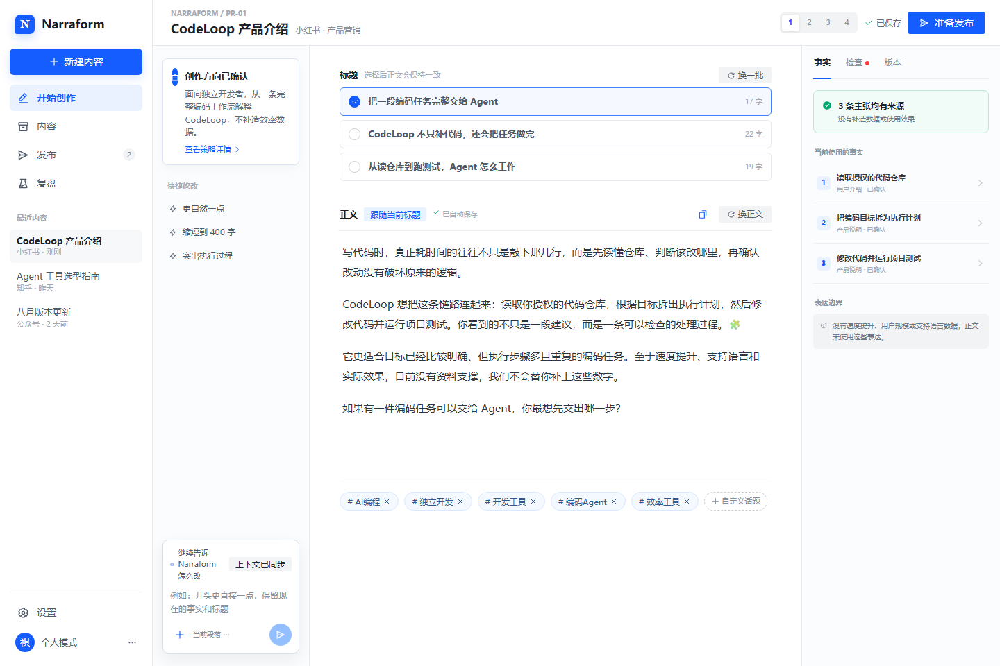

# PR-01：内容引擎产品化

> 阶段目标：把现有“能生成”能力整理为普通用户可理解、可连续编辑、可追溯的内容工作台。



## 1. 背景与问题

Narraform 已具备 `TaskBrief`、`FactSet`、三策略、平台 Spec、Content Operation Spec 和质量检查，但前端状态集中在单文件，标题、正文、话题、版本和检查结果缺少统一内容状态。生成成功不等于用户能放心完成一篇内容。

本阶段解决三个问题：

1. 用户只需描述“写什么”，系统在后台提取事实、目标、受众和限制。
2. 标题、正文、话题、润色、自定义编辑走同一个操作引擎，并明确字段联动。
3. 生成、自动重试、流式写入、自动保存和版本恢复形成闭环。

## 2. 用户故事

- 作为普通创作者，我输入产品介绍和目标平台后，希望直接得到可编辑初稿。
- 作为谨慎的产品方，我希望知道哪些表达来自资料、哪些只是建议。
- 作为反复修改的用户，我希望“换标题”不破坏正文，“换正文”服从当前标题。
- 作为编辑者，我希望手动改动自动保存，并能回到任意历史版本。

## 3. 范围

### 包含

- 将创作页拆为会话区、编辑画布、上下文检查栏。
- 建立统一 `ContentState` 和 `OperationRequest`。
- 首次生成、换标题、换正文、润色、自定义修改统一编排。
- 富文本逐字流式写入、取消生成、失败自动重试。
- 500ms 防抖自动保存、保存状态提示、版本历史。
- 事实与表达风险检查，面向用户显示可理解的修复建议。

### 不包含

- 图片 OCR 与视觉理解。
- 平台登录、草稿保存或直接发布。
- 发布后的数据采集和增长建议。

## 4. 高保真界面设计

参考：`09-long-form-content-editor.png` 的文档画布、`19-fact-claim-review.png` 的事实检查侧栏和 Intercom 式对话上下文。

- 左侧 264px：轻量导航与最近内容，不显示工作空间或组织管理。
- 中部弹性画布：标题候选、正文编辑器、话题标签；正文占据主要视觉空间。
- 右侧 292px：资料事实、表达检查、版本记录三个 Tab。
- 底部助手输入框固定于画布，不遮挡正文；支持“更自然”“缩短”“改得更专业”等快捷操作。
- 所有手动编辑自动保存；状态仅显示“保存中 / 已保存 / 保存失败”。

## 5. 后端实现设计

### 5.1 模块

| 模块 | 现有能力 | 本阶段改动 |
|---|---|---|
| Task Understanding | `task-understanding.js` | 输出稳定的 `TaskBrief + FactSet` |
| Strategy Engine | `strategy-engine.js` | 候选策略附选择理由和事实引用 |
| Content Engine | `content-engine.js` | 只负责生成候选，不直接写存储 |
| Operation Engine | `operation-engine.js` | 成为所有内容变化的唯一入口 |
| Quality Gate | `quality.js` | 输出阻断、警告、自动修复三类结果 |
| Content Repository | `store.js` | 乐观锁、自动保存、版本快照 |

### 5.2 API

```text
POST /api/tasks/understand
POST /api/tasks/:taskId/select-strategy
POST /api/content-operations/stream
PATCH /api/contents/:id             If-Match: <revision>
GET   /api/contents/:id/versions
POST  /api/contents/:id/versions/:versionId/restore
```

流式操作事件固定为：`operation.started`、`field.reset`、`field.delta`、`quality.completed`、`version.saved`、`operation.completed`、`operation.failed`。正文流式变化只写入目标字段，完成后一次性提交版本。

### 5.3 状态机

```text
empty → understanding → needs_input | strategy_ready
strategy_ready → generating → ready
ready → editing | operating → autosaving → ready
operating → retrying → ready | failed
ready → restoring → ready
```

## 6. Spec

执行规范见 [content-engine-spec-v1.md](./specs/content-engine-spec-v1.md)。

### 示例：换标题必须跟随现有正文

输入摘要：当前正文讲“CodeLoop 自动读取仓库、规划改动、执行测试”，用户点击换一批标题。

```json
{
  "operation": "regenerate_titles",
  "contentId": "cnt_codeloop_xhs_01",
  "baseRevision": 7,
  "selectedTitle": "把重复改代码的流程交给 Agent",
  "preserve": ["bodyMarkdown", "topics", "commentPrompt"]
}
```

输出必须只更新 `titleCandidates` 和 `selectedTitleIndex`，正文哈希保持不变；质量检查确认每个标题都能被当前正文支撑。

## 7. 验收标准

- 从输入需求到可编辑初稿不超过 3 个用户动作。
- 五类内容操作全部通过同一个接口和权限规则执行。
- 换标题不改变正文；换正文依据选中标题同步更新话题。
- 流式过程可取消，失败最多自动重试 2 次，不要求用户重复确认。
- 手动编辑 500ms 后自动保存；刷新页面恢复最后成功版本。
- 前端单文件拆为页面、画布、助手、检查栏和状态层，核心组件具备独立测试入口。

## 8. 风险与回滚

- 并发编辑冲突：使用 `baseRevision`，冲突返回 `CONTENT_REVISION_CONFLICT`。
- 流式中断导致半成品：仅在 `operation.completed` 后落正式版本，草稿缓冲单独保存。
- 质量检查过严：区分阻断与建议；缺少真实数字不阻止正常宣传，只禁止系统补造。
- 回滚：保留现有 `/api/generate` 与 `/api/modify` 一个版本周期，前端通过开关切回旧链路。
