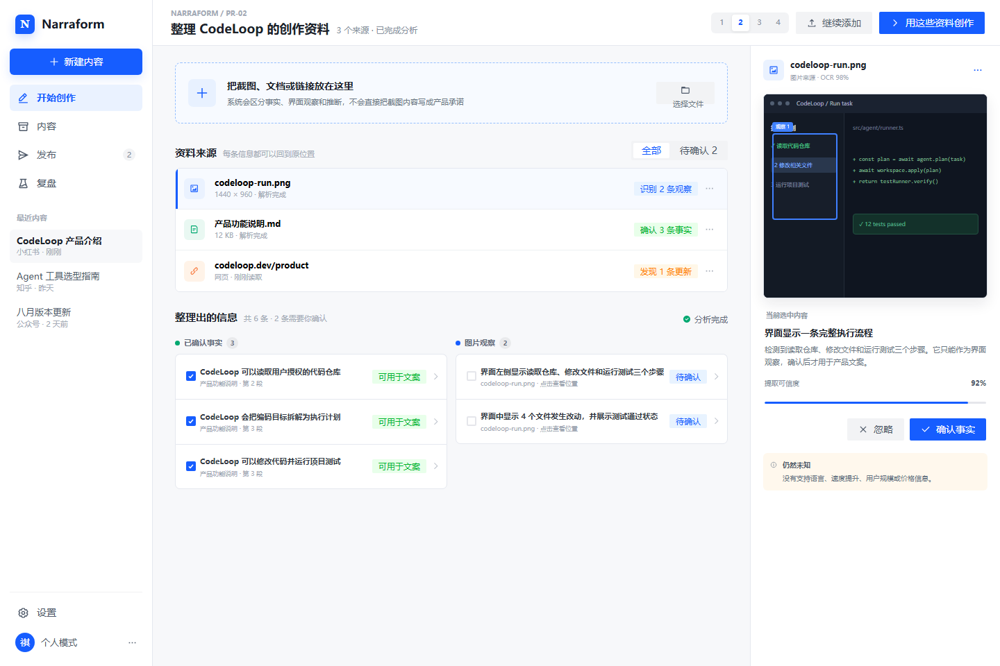

# PR-02：全类型素材理解

> 阶段目标：让用户只给一句话、截图、文档或网页，也能生成“有依据、不过度脑补”的内容任务。



## 1. 背景与问题

现有素材模块可以读取 TXT、Markdown、PDF、DOCX 与网页，但缺少图片理解、来源定位、冲突处理和用户确认机制。系统必须区分“图片里看到了什么”“资料明确说了什么”“模型推断了什么”，否则生成内容容易把界面观察误写成产品承诺。

## 2. 用户故事

- 我只有产品截图和一句介绍，也希望系统先整理信息再写文案。
- 我上传多份资料时，希望系统指出重复、冲突和缺失，而不是直接拼接。
- 我不提供素材时，希望系统仍能按我的描述写，但不能虚构数据和亲测经历。
- 我希望点击任一事实可以定位到原图片区域、文档页码或网页段落。

## 3. 范围

### 包含

- 图片、PDF、DOCX、Markdown、TXT、URL 和纯文本统一进入 `MaterialSet`。
- 图片 OCR、界面元素识别、产品能力候选提取。
- 来源片段、置信度、冲突、未知项与用户修正。
- 事实卡可编辑；用户修正确认为最高优先级来源。
- 无素材降级：把用户描述作为 `user_claim`，允许宣传性表达但不补造证据。

### 不包含

- 视频逐帧理解和音频转写。
- 在线搜索替用户补资料。
- 素材资产库和团队权限。

## 4. 高保真界面设计

参考：`13-reference-source-collector.png` 的来源采集结构和 `19-fact-claim-review.png` 的证据核对方式。

- 左侧保持 Narraform 导航。
- 主区顶部是自然语言投递区，支持拖入截图或文件，并显示真实缩略图与解析状态。
- 主区下方按“已确认事实 / 图片观察 / 待确认 / 未知信息”分组，不混成一张大表。
- 右侧显示当前选中事实的来源预览、定位框、置信度与“确认 / 修正 / 忽略”。
- 用户不必逐项确认；只有冲突或低置信度且会影响主要主张时才阻断生成。

## 5. 后端实现设计

### 5.1 处理流水线

```text
ingest → normalize → extract → locate evidence → deduplicate
→ detect conflicts → classify confidence → build FactSet → user corrections
```

### 5.2 服务边界

| 服务 | 职责 |
|---|---|
| Material Ingestor | MIME 校验、大小限制、哈希去重、病毒扫描适配点 |
| Document Parser | 文档文本、页码、标题层级、表格提取 |
| Vision Adapter | OCR、界面区域、可见文本和视觉观察 |
| Evidence Resolver | 把事实绑定到 `sourceId + locator` |
| Fact Reconciler | 去重、冲突检测、置信度和未知项 |
| Correction Store | 保存用户确认、修正与忽略决定 |

### 5.3 API

```text
POST  /api/material-sets
POST  /api/material-sets/:id/items
GET   /api/material-sets/:id/analysis
PATCH /api/material-sets/:id/facts/:factId
POST  /api/material-sets/:id/resolve-conflicts
POST  /api/tasks/understand   materialSetId=<id>
```

分析任务异步执行，返回 `queued | processing | ready | partial | failed`。单项解析失败不应让整个素材集失败。

## 6. Spec

执行规范见 [material-understanding-spec-v1.md](./specs/material-understanding-spec-v1.md)。

### 示例：截图 + 一句话

```json
{
  "instruction": "这是 CodeLoop，一个能协助完成编码任务的 Agent，帮我写小红书介绍。",
  "items": [{"type": "image", "name": "codeloop-run.png"}]
}
```

期望分析结果会把“界面中出现任务计划、文件改动和测试结果”记为 `image_observation`；把“能协助完成编码任务”记为 `user_claim`；不会自行生成“提升 10 倍效率”“支持所有语言”等事实。

## 7. 验收标准

- 支持 7 种输入来源，所有来源进入统一对象。
- 任一事实均有 `sourceType`；有文件来源时必须有可定位 `locator`。
- 图片观察与产品事实不混淆，低置信度主要主张需用户确认。
- 多素材冲突可见、可选择；用户修正后重新生成 `FactSet`。
- 无截图、无文件时仍可根据用户描述继续创作，并明确证据等级。
- 解析过程展示逐项状态，失败项可单独重试或移除。

## 8. 风险与回滚

- OCR 错误：保留原图定位和置信度，不让 OCR 文本自动成为强事实。
- 敏感资料：默认本地临时存储，日志不记录正文；提供删除素材集接口。
- 模型不可用：文档文本解析继续可用，图片标为 `analysis_unavailable`。
- 回滚：任务理解仍接受现有 `materials[]` 文本格式。
