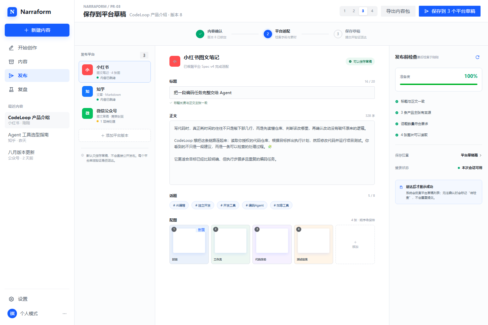

# PR-03：平台草稿发布

> 阶段目标：把已审核内容转换为平台可接受的发布包，优先保存草稿，并用回执验证“真的送达”。



## 1. 背景与问题

当前系统生成平台文案，但还没有发布交付层。直接让内容引擎操作浏览器会把生成、登录、上传、发布和失败恢复耦合在一起。阶段三建立独立 Delivery Adapter：内容引擎输出稳定发布包，平台适配器负责能力探测、草稿提交和回执验证。

## 2. 用户故事

- 我希望一次确认各平台内容，再分别保存到平台草稿箱。
- 平台格式不同，我希望系统提前告诉我哪里超限、缺封面或不支持。
- 发布失败时，我希望知道卡在哪一步，并能只重试失败平台。
- 在没有平台账号中心的 MVP 中，我可以在执行发布时临时完成登录。

## 3. 范围

### 包含

- 小红书、知乎、微信公众号三类 `PublishPackage`。
- 发布前平台约束检查和字段映射。
- 草稿优先，直接发布必须二次确认且由适配器声明支持。
- 临时登录会话、二维码/浏览器登录状态提示，不建立账号管理页。
- 幂等提交、逐步骤进度、失败重试和 `DeliveryReceipt` 验证。
- 手动导出兜底：Markdown、复制字段、图片打包。

### 不包含

- 多账号矩阵、账号权限、团队审批。
- 定时发布队列。
- 自动评论和互动。
- 无确认的批量直接发布。

## 4. 高保真界面设计

参考：`24-multi-channel-adaptation.png` 的平台差异对照和 `31-export-publishing-center.png` 的发布任务状态。

- 顶部用步骤条表达“内容确认 → 平台适配 → 保存草稿”。
- 左侧为平台列表和状态；中部为当前平台字段，不做逼真的手机预览。
- 右侧固定显示发布前检查、素材清单与送达状态。
- 主按钮文案是“保存到 3 个平台草稿”，不是模糊的“发布”。
- 每个平台独立显示准备中、等待登录、上传中、验证中、已送达或失败。

## 5. 后端实现设计

### 5.1 架构

```text
ContentState → Package Builder → Preflight Validator → Delivery Job
→ Platform Adapter → Receipt Verifier → DeliveryReceipt
```

平台适配器接口：

```ts
interface DeliveryAdapter {
  capabilities(): Promise<PlatformCapabilities>;
  checkSession(): Promise<SessionState>;
  createDraft(pkg: PublishPackage, idempotencyKey: string): Promise<AdapterResult>;
  verify(result: AdapterResult): Promise<DeliveryReceipt>;
}
```

优先复用已安装发布能力：小红书浏览器适配器、知乎浏览器适配器、公众号 API/草稿箱适配器。Skill 规范只作为适配器实现参考，不直接暴露给 UI。

### 5.2 API

```text
POST /api/publish-packages
POST /api/publish-packages/:id/preflight
POST /api/delivery-jobs
GET  /api/delivery-jobs/:id/events
POST /api/delivery-jobs/:id/retry
POST /api/delivery-jobs/:id/cancel
GET  /api/delivery-receipts/:id
```

### 5.3 送达状态

```text
created → preflight_failed | ready
ready → waiting_session → submitting → verifying
verifying → delivered | uncertain | failed
```

`uncertain` 不能显示为成功。只有拿到平台草稿 ID、可访问草稿 URL 或通过草稿列表反查，才允许 `verified=true`。

## 6. Spec

执行规范见 [publish-delivery-spec-v1.md](./specs/publish-delivery-spec-v1.md)。

### 示例：小红书草稿

输入 `PublishPackage` 包含选中标题、正文、5 个话题和 4 张图；适配器保存草稿后返回：

```json
{
  "status": "delivered",
  "target": "draft",
  "platform": "xiaohongshu",
  "remoteDraftId": "xhs_draft_82941",
  "verified": true,
  "verificationMethod": "draft_list_lookup"
}
```

如果仅完成点击但无法反查，必须返回 `status: "uncertain"`，并提供手动检查入口。

## 7. 验收标准

- 三个平台发布包均通过 schema 和平台约束检查。
- 默认操作是保存草稿；直接发布需要清晰二次确认。
- 单平台失败不影响其他平台，支持只重试失败项。
- 所有请求具备幂等键，重复点击不产生重复草稿。
- 成功状态必须有可验证回执，不能用“按钮点过”代替成功。
- 未登录时在任务内引导临时登录，不要求先配置账号中心。

## 8. 风险与回滚

- 平台页面变化：适配器版本化并提供手动导出兜底。
- 登录过期：任务进入 `waiting_session`，登录后从原步骤续跑。
- 重复草稿：幂等键绑定 `packageId + platform + revision`。
- 回滚：关闭单个平台适配器，不影响内容生成与导出。
