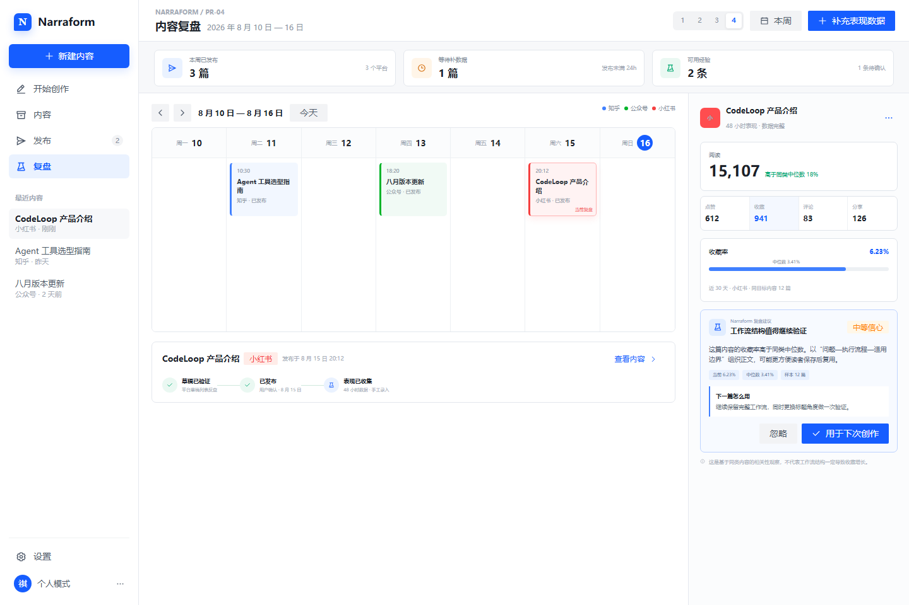

# PR-04：反馈闭环

> 阶段目标：把发布结果和人工判断变成下一篇内容可执行的建议，而不是只做数据看板。



## 1. 背景与问题

生成与发布完成后，如果数据不回到策略层，用户每次都从头试。阶段四记录内容、策略、平台版本、发布回执和表现快照的关系，生成可解释的复盘建议。MVP 不承诺自动增长，只帮助用户看清“什么内容、面向谁、在哪个平台、产生了什么信号”。

## 2. 用户故事

- 我希望看到一篇内容从创建、修改、发布到表现的完整时间线。
- 平台无法自动读取数据时，我可以快速手工录入核心指标。
- 我希望系统比较同平台同目标内容，而不是把小红书收藏和公众号阅读直接混比。
- 我希望下一次生成时可以选择采用某条已验证经验。

## 3. 范围

### 包含

- 发布回执自动进入内容日历和表现记录。
- 平台 API、浏览器读取或手工录入三种指标来源。
- 指标标准化但保留原始值和平台语义。
- 同平台、同目标、相近内容类型的基线比较。
- 生成“观察 → 证据 → 建议 → 适用范围”的复盘卡。
- 用户确认的经验进入 `LearningRule`，下次策略推荐可选择使用。

### 不包含

- 自动投放、自动追热点、自动改发已发布内容。
- 跨账号归因、商业 BI 和收入归因。
- 用单篇数据自动修改全局提示词。

## 4. 高保真界面设计

参考：`28-content-calendar-scheduling.png` 的时间组织方式和发布复盘页的结果状态。

- 首屏是本周内容时间线，而非复杂仪表盘。
- 顶部只显示“已发布、待补数据、有可用经验”三个面向行动的指标。
- 选中内容后展示平台原始指标、相近内容基线和一张复盘卡。
- 建议必须带证据，用户可“用于下次创作 / 忽略 / 编辑”。
- 不使用红绿分数羞辱内容；用“高于常态 / 接近常态 / 数据不足”。

## 5. 后端实现设计

### 5.1 数据链

```text
DeliveryReceipt → Metric Connector / Manual Input
→ PerformanceSnapshot → Baseline Comparator
→ Insight Generator → LearningRule (user approved)
→ Strategy Engine context
```

### 5.2 API

```text
POST /api/performance-snapshots
POST /api/performance-snapshots/import
GET  /api/contents/:id/performance
POST /api/contents/:id/retrospective
POST /api/learning-rules/:id/approve
PATCH /api/learning-rules/:id
GET  /api/strategy-context?platform=xiaohongshu&goal=collect
```

### 5.3 比较原则

- 只在相同平台、相同目标、相似发布时间窗之间比较。
- 样本少于 5 条时只显示原始数据，不做趋势结论。
- 互动率等派生指标必须保存公式和分母。
- 手工录入标记 `source=manual`，不能伪装成平台同步。
- 复盘建议默认是候选，只有用户确认后才能影响后续策略。

## 6. Spec

执行规范见 [feedback-loop-spec-v1.md](./specs/feedback-loop-spec-v1.md)。

### 示例：从表现到建议

```json
{
  "platform": "xiaohongshu",
  "contentId": "cnt_codeloop_xhs_01",
  "metrics": {"impressions": 18420, "likes": 612, "saves": 941, "comments": 83}
}
```

系统只能在有同类基线时输出：“收藏率高于近 30 天同目标内容中位数，教程式步骤可能更利于留存”；不能输出“以后都使用这个标题”或把相关性写成因果。

## 7. 验收标准

- 每条表现快照可追溯至内容版本和发布回执。
- 支持自动同步失败后的手工录入，不阻断复盘。
- 样本不足时不生成伪趋势；建议明确证据和适用范围。
- 用户可以批准、修改、停用一条学习规则。
- 新任务可查看将被采用的历史经验，并可取消应用。
- 删除内容时按策略删除或匿名化对应表现数据。

## 8. 风险与回滚

- 指标口径差异：保留平台原始名和统一名的双层映射。
- 过拟合：最低样本阈值、时间衰减、必须人工批准。
- API 不稳定：手工录入作为正式能力，而非临时异常路径。
- 回滚：关闭策略注入，保留只读表现记录和复盘页。
